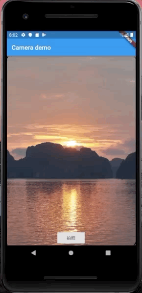

# CameraAperture_mobile

Camera Aperture animation for mobile by Flutter

Flutter的移动端相机快门动画封装

#### Created by Alfonso Cejudo, Saturday, July 13th 2019.  [link](https://github.com/alfonsocejudo/aperture_demo)

这是Alfonso Cejudo封装的快门动画，Alfonso的设计是圆盘快门动画。我在他的基础和原理上进行二次封装，可以进行移动端全屏视觉的动画效果。

这个[链接](https://medium.com/jet-set-digital/camera-aperture-animation-flutter-ft-custompainter-animatedbuilder-clipoval-3ab296e7de58)可以看到更多他的动画原理，值得观摩。

---

核心原理：

 - aperture.dart
   定义ApertureBladePainter类的属性和方法
 - aperture_blades.dart
   计算动画的逻辑和封装
 - aperture_blade_painter.dart
   引用ApertureBladePainter类和外观布局
